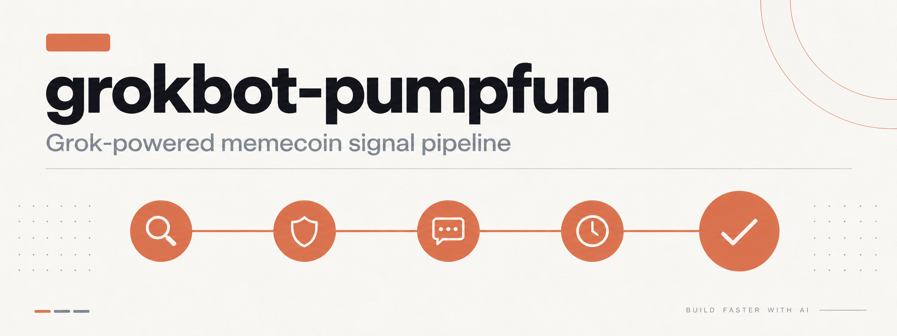
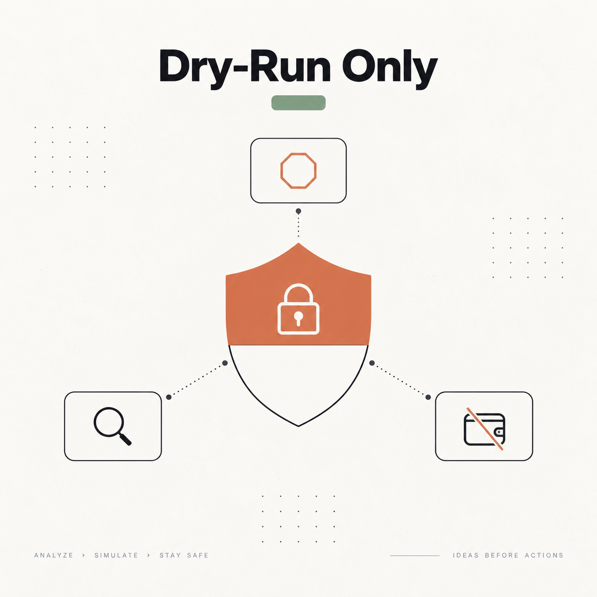
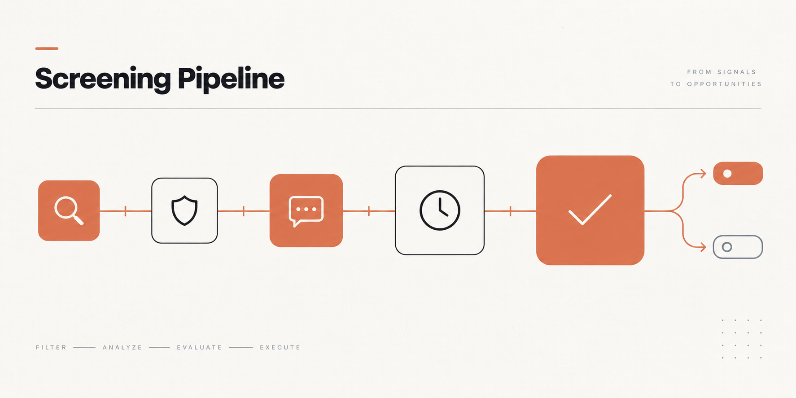
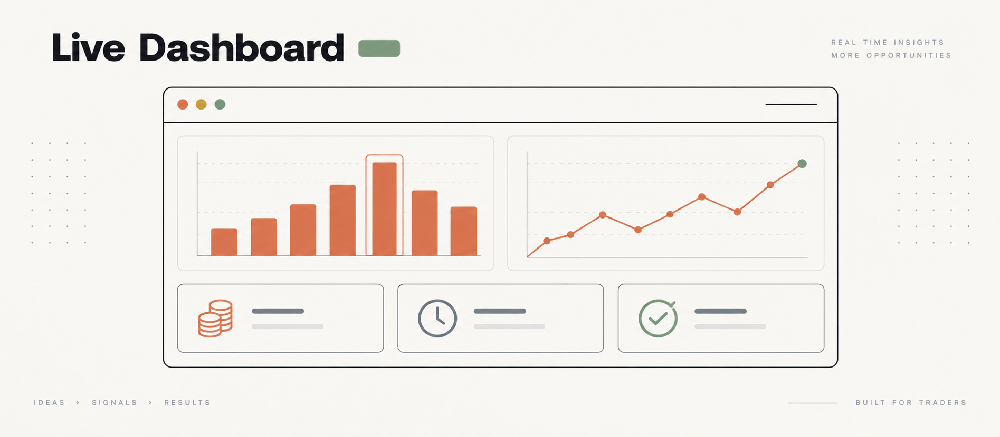
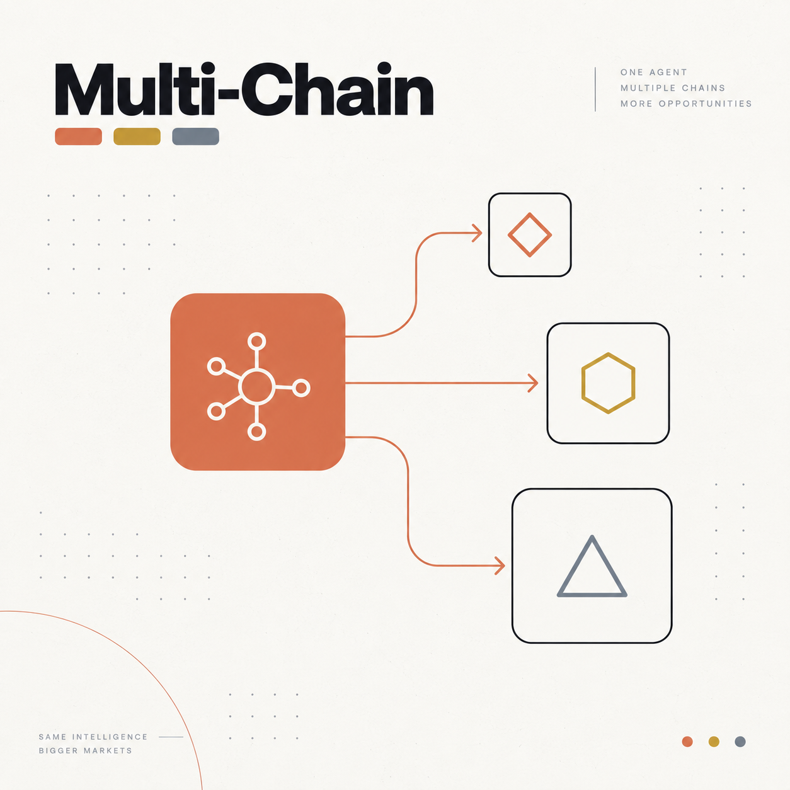

<p align="center">
  
</p>

<p align="center">
  <a href="https://github.com/AtenovD/grokbot-pumpfun/actions/workflows/ci.yml"></a>
  <a href="https://railway.com/new/template?template=https%3A%2F%2Fgithub.com%2FAtenovD%2Fgrokbot-pumpfun&amp;envs=BOT_TOKEN%2CADMIN_IDS%2CGROK_API_KEY"></a>
  <a href="https://render.com/deploy?repo=https%3A%2F%2Fgithub.com%2FAtenovD%2Fgrokbot-pumpfun"></a>
</p>

<p align="center">
  <a href="https://github.com/AtenovD/grokbot-pumpfun/stargazers"></a>
  <a href="https://github.com/AtenovD/grokbot-pumpfun/blob/main/LICENSE"></a>
  <a href="https://github.com/AtenovD/grokbot-pumpfun/commits/main"></a>
</p>
<p align="center">
  
  
  
  
</p>

<p align="center">
  A Telegram bot that screens new pump.fun, Clanker, and hood.fun token launches through four Grok-powered agents, a risk manager, and a creator reputation book — then simulates the trade. No live execution, ever.
</p>

<table align="center">
  <tr>
    <td align="center"></td>
    <td align="center"><a href="https://railway.com/new/template?template=https%3A%2F%2Fgithub.com%2FAtenovD%2Fgrokbot-pumpfun&envs=BOT_TOKEN%2CADMIN_IDS%2CGROK_API_KEY"></a></td>
    <td align="center"></td>
    <td align="center"><a href="https://render.com/deploy?repo=https%3A%2F%2Fgithub.com%2FAtenovD%2Fgrokbot-pumpfun"></a></td>
  </tr>
  <tr>
    <td align="center"></td>
    <td align="center"><a href="#deploy-with-docker"></a></td>
    <td align="center"></td>
    <td align="center"><a href="#deploy-on-a-vps-systemd"></a></td>
  </tr>
  <tr>
    <td align="center"></td>
    <td align="center"><a href="#quick-start"></a></td>
    <td align="center"></td>
    <td align="center"><a href="#read-only-dashboard"></a></td>
  </tr>
  <tr>
    <td align="center"></td>
    <td align="center"><a href="docs/webhook-schema.md"></a></td>
    <td align="center"></td>
    <td align="center"><a href="docs/adding-a-chain.md"></a></td>
  </tr>
</table>

<p align="center">
  
</p>

## ⚠️ What this is and isn't

This is a **research/screening tool**, not a trading bot. Every "buy" and "sell" is simulated (dry-run): no wallet, no signing, no on-chain transaction. Bonding-curve memecoins on pump.fun routinely lose their entire value; nothing here is financial advice, and there is no live executor to wire up — that's a deliberately different, much higher-stakes piece of software that this project does not include.

<p align="center">
  
</p>

## Features

<p align="center">
  
</p>

- **Multi-chain launch monitor** — watches Solana/pump.fun, Base/Clanker, and Robinhood Chain/hood.fun through per-chain adapters, filters by age and buyer count before spending a single Grok call
- **Five agents**, cheapest first:
  - **Researcher** — free DB lookups before any Grok call: has this creator rugged before, and does this name/symbol exactly or semantically copy a recent token
  - **Auditor** (Grok) — looks for wash trading / bundled buys in the trade and holder data
  - **Narrative** (Grok) — scores the meme's attention potential from its name/symbol
  - **Timing** (Grok) — judges the current window using only this bot's own observed launch/outcome rate (no external price feeds)
  - **Checker** (Grok, stronger model) — an adversarial final pass given all four prior verdicts, explicitly looking for a reason to reject
- **Real price tracking** — open dry-run positions are watched against the chain's actual bonding-curve or DEX-pool price, not a random number
- **Real stop-loss** — a position is force-closed the moment its real observed drawdown from entry crosses `STOP_LOSS_PCT`
- **Circuit breaker on Grok** — after several consecutive failures, the pipeline stops calling Grok for a cooldown window instead of hammering a struggling API on every new launch
- **Explainability digest** — the four agent verdicts are synthesized by Grok into one short, readable paragraph for the alert, instead of four raw JSON summaries
- **Optional user Grok OAuth** — users can connect their own Grok account with authorization-code PKCE and request a fresh, detailed second opinion for a signal; encrypted user tokens never replace the bot's core `GROK_API_KEY` pipeline
- **Prompt-injection resistant** — token symbol/name/description are attacker-controlled; they're sanitized and every agent prompt explicitly frames them as data, not instructions, before anything reaches Grok
- **Risk manager** — five independent limits: max SOL per trade, daily loss limit, max trades/day, max open positions, stop-loss — pure arithmetic, no model involved, and the last gate before a (simulated) trade
- **Reputation book** — creators are blocked after their tracked launches rug, forgotten after a configurable number of days
- **Dry-run executor** — simulates entry/exit at real observed prices, feeding the reputation book and daily counters exactly like a live executor would
- **Backtest report** — replays recorded signals and closed dry-run positions to show funnel counts, win rate, PnL distribution, and stop-loss frequency
- **Weekly public digest** — optionally publishes the previous seven days of recorded backtest performance to a separate public channel
- **Button-only Telegram frontend**: RU/EN language picker, stats, open positions, optional mandatory-subscription gate, button-driven admin panel — no slash commands beyond `/start`
- **Read-only web dashboard** — responsive funnel, recorded-performance summary, open positions, and a polling JSON stats endpoint without a second market-data connection
- **Versioned signal webhooks** — optionally POST every passing `TokenAnalysis` to multiple integrations with one retry and a stable v1 JSON envelope
- **Prometheus metrics** — dashboard `/metrics` exposes cumulative screening outcomes, positions, Grok circuit-breaker state, and per-chain price-feed health

## Stack

Python 3.12, [aiogram 3](https://docs.aiogram.dev/), aiohttp, `websockets`, aiosqlite. Optional FastAPI/Jinja dashboard. Grok API (xAI) for the four agents.

## Quick start

```bash
python3 -m venv venv
source venv/bin/activate
pip install -r requirements.txt
# Optional local all-MiniLM-L6-v2 semantic copycat matching:
pip install -r requirements-semantic.txt
cp .env.example .env  # fill in BOT_TOKEN, ADMIN_IDS, GROK_API_KEY
python -m bot.main
```

## Deploy on a VPS (systemd)

```bash
sudo mkdir -p /opt/pumpguard-bot
sudo cp -r . /opt/pumpguard-bot
cd /opt/pumpguard-bot
python3 -m venv venv && venv/bin/pip install -r requirements.txt
cp .env.example .env  # fill in
sudo cp deploy/pumpguard-bot.service /etc/systemd/system/
sudo systemctl daemon-reload
sudo systemctl enable --now pumpguard-bot
```

Install the optional dashboard dependencies and service when the web view is needed:

```bash
venv/bin/pip install -r requirements-dashboard.txt
sudo cp deploy/pumpguard-dashboard.service /etc/systemd/system/
sudo systemctl daemon-reload
sudo systemctl enable --now pumpguard-dashboard
```

## Deploy with Docker

```bash
docker compose up -d --build
```

## Deploy on Railway or Render

The deploy buttons above prompt for the three required values: `BOT_TOKEN`, `ADMIN_IDS`, and `GROK_API_KEY`. Both platform definitions mount a persistent volume and set `DB_PATH` to that volume so SQLite data survives deploys. Add any optional variables from `.env.example` after provisioning; enable additional chains only after setting their corresponding endpoints.

Railway's current project-level Infrastructure as Code definition is `.railway/railway.ts`. To review and apply it manually, install the Railway CLI and run `npm install`, `railway link`, `railway config plan`, then `railway config apply`. Render reads `render.yaml` automatically when the repository is opened as a Blueprint.

## Configuration (`.env`)

| Variable | Description |
|---|---|
| `BOT_TOKEN` | bot token from @BotFather |
| `ADMIN_IDS` | comma-separated admin user IDs |
| `GROK_API_KEY` | xAI API key — used only for the four screening agents |
| `GROK_FAST_MODEL` / `GROK_CHECKER_MODEL` | models for the three cheap agents vs. the adversarial checker |
| `DATA_WS_URL` | pump.fun launch feed (defaults to PumpPortal's public endpoint) |
| `ENABLED_CHAINS` | comma-separated adapter list: `solana`, `base`, `robinhood` (defaults to `solana`) |
| `BASE_DATA_URL` / `BASE_RPC_URL` | Clanker public API and Base RPC used for source verification/fallback |
| `ROBINHOOD_DATA_URL` / `ROBINHOOD_RPC_URL` | hood.fun public indexer root and Robinhood Chain RPC used for source verification/fallback |
| `MIN_LAUNCH_AGE_SECONDS` / `MIN_UNIQUE_BUYERS` | pre-filter before any Grok call is made |
| `COPYCAT_SIMILARITY_THRESHOLD` | cosine threshold for optional semantic copycat matching (default `0.85`) |
| `MAX_SOL_PER_TRADE` / `DAILY_LOSS_LIMIT_SOL` / `MAX_TRADES_PER_DAY` / `MAX_OPEN_POSITIONS` | risk manager limits |
| `RUG_LOSS_PCT` / `BLOCK_CREATOR_AFTER_RUGS` / `FORGET_CREATORS_AFTER_DAYS` | reputation book tuning |
| `STOP_LOSS_PCT` | real drawdown from entry that force-closes a dry-run position |
| `GROK_BREAKER_FAILURE_THRESHOLD` / `GROK_BREAKER_COOLDOWN_SECONDS` | circuit breaker tuning for Grok outages |
| `ALERT_CHAT_ID` | optional channel/group every passing signal is also posted to |
| `WEBHOOK_URLS` | optional comma-separated webhook endpoints for passing signals; see `docs/webhook-schema.md` |
| `PUBLIC_DIGEST_CHAT_ID` | optional, separate channel for the weekly seven-day performance digest |
| `DASHBOARD_PORT` | read-only dashboard listen port (defaults to `8000`) |
| `XAI_OAUTH_CLIENT_ID` / `XAI_OAUTH_CLIENT_SECRET` | credentials for an optional xAI OAuth application |
| `XAI_OAUTH_REDIRECT_URI` | public dashboard callback URL, ending in `/oauth/callback` |
| `OAUTH_ENCRYPTION_KEY` | Fernet key used to encrypt OAuth access and refresh tokens at rest |

## Optional Grok account connection

Registering an OAuth application is separate from funding an xAI API account and does not itself buy or consume API credits. Set the four `XAI_OAUTH_*`/`OAUTH_ENCRYPTION_KEY` variables above, register the exact redirect URI with xAI, and expose the dashboard callback over HTTPS. Users can then tap **🔐 Connect Grok account**. The bot stores the short-lived PKCE request for ten minutes, encrypts returned tokens with Fernet, and refreshes an expired access token before an **🔎 Ask Grok** request.

The regular four-agent screening and digest continue to use only `GROK_API_KEY`. User OAuth tokens are used exclusively for the user-triggered second opinion. Dashboard analytics still use a read-only SQLite connection; `/oauth/callback` opens a short-lived writer limited to completing the authorization flow.

## Read-only dashboard

<p align="center">
  
</p>

Run `python -m dashboard.main` or `uvicorn dashboard.main:app`. The dashboard opens the bot's SQLite file with SQLite `mode=ro`; it issues only `SELECT`/`PRAGMA` queries. The bot periodically stores the latest observed price for each open position so `/positions` can display it without starting another PumpPortal connection.

Routes:

- `/` — 1h/24h/7d screening funnel plus recorded backtest metrics
- `/positions` — open dry-run positions and the latest bot-written price snapshot
- `/api/stats` — JSON equivalent of the Telegram statistics view, polled by the dashboard
- `/metrics` — Prometheus text exposition for operational monitoring

**Do not expose analytics routes publicly without authentication in front of them.** If OAuth is enabled, the callback must remain publicly reachable over HTTPS; configure a reverse proxy that allows `/oauth/callback` while protecting the analytics routes.

## Chain data sources and pricing

Contributor documentation: [add a new chain or launchpad adapter](docs/adding-a-chain.md).

<p align="center">
  
</p>

- **Solana / pump.fun** uses PumpPortal's public WebSocket for launches and per-mint trades. Pre-graduation price is `virtual SOL reserves / virtual token reserves`, preserving the existing behavior.
- **Base / Clanker** polls Clanker's [official public token API](https://clanker.gitbook.io/clanker-documentation/api-reference/public/tokens) with `chainId=8453` and `includeMarket=true`. Clanker launches directly into Uniswap pools (v4 for current launches, with legacy v3 pools); the adapter uses the indexer's pool-derived `priceUsd`. Tokens are held until that price is non-zero, so the executor never invents an EVM entry price.
- **Robinhood Chain / hood.fun** polls hood.fun's own read-only `/api/board` indexer. Before graduation it calculates the native ETH price from the documented constant-product virtual reserves, `virtualEth / virtualTokens`; after migration it uses `pairPriceWei`, which is sourced from the official Uniswap v3 pool. Robinhood Chain is Arbitrum Orbit chain `4663`; its public RPC is rate-limited, so production operators should set a dedicated `ROBINHOOD_RPC_URL`.

The REST polling interval is five seconds. `BASE_RPC_URL` and `ROBINHOOD_RPC_URL` are intentionally read-only configuration: they provide a stable verification/fallback endpoint without adding wallets, signing, or any live execution path.

The two EVM indexers do not expose an authoritative unique-buyer count in their launch records, so that one pre-filter is skipped when the adapter reports the value as unavailable; all remaining researcher, agent, checker, risk, and dry-run stages are unchanged. Solana continues to enforce `MIN_UNIQUE_BUYERS` from PumpPortal data.

Semantic copycat detection is local and optional. When `requirements-semantic.txt` is installed, `sentence-transformers/all-MiniLM-L6-v2` is loaded lazily on the first researcher run and compared only with tokens from the same chain and six-hour lookback. If the package or model is unavailable, the bot logs one warning and continues with the existing normalized exact matcher.

## Admin panel

Any user ID in `ADMIN_IDS` sees a "🛠 Admin panel" button on the main menu:

- **📊 Stats** — users, tokens screened, dry-run buys, today's simulated P&L, open positions, blocked creators
- **📈 Backtest** — all-time funnel, win rate, average/median PnL, best/worst trade, and stop-loss hit rate
- **📣 Broadcast** — send a message to every known user
- **📢 Channels** — set or unset the mandatory-subscription channel per interface language

## License

MIT — see [LICENSE](LICENSE).
